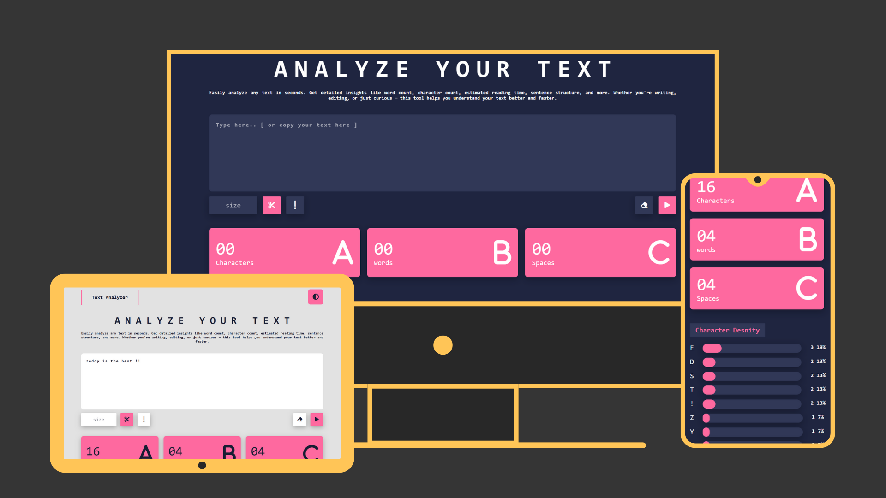

# 📝 Text Analyzer

A powerful and clean text analyzer that gives you full insights into your text — from letter and word stats to limit controls and more.

## 🌟 Features

- 🌗 Toggle between Dark Mode and Light Mode  
- 🔠 Counts:
  - Words  
  - Letters  
  - White spaces  
- 📊 Letter frequency analysis:
  - How many times each letter appears  
  - Percentage of total text  
- ⛔ Set a character limit:
  - Get alerted when you exceed it  
  - Instantly cut the text to the limit with one click  
- 🎨 Intuitive and responsive design
- 🗑️ Reset and clear all with one click 

## 💻 Tech Stack

- HTML  
- CSS  
- Vanilla JavaScript  

## 🚀 Live Demo

Try it here 👇  
https://zeddy-foreal.github.io/text-analyzer

## 📸 Preview



## 📁 How to Run Locally

```bash
git clone https://github.com/zeddy-foreal/text-analyzer.git
cd text-analyzer
# Then open index.html in your browser
